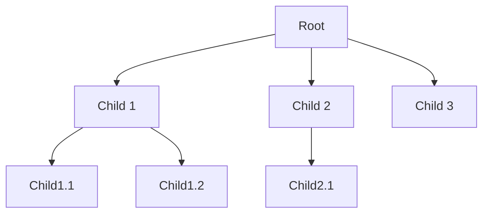
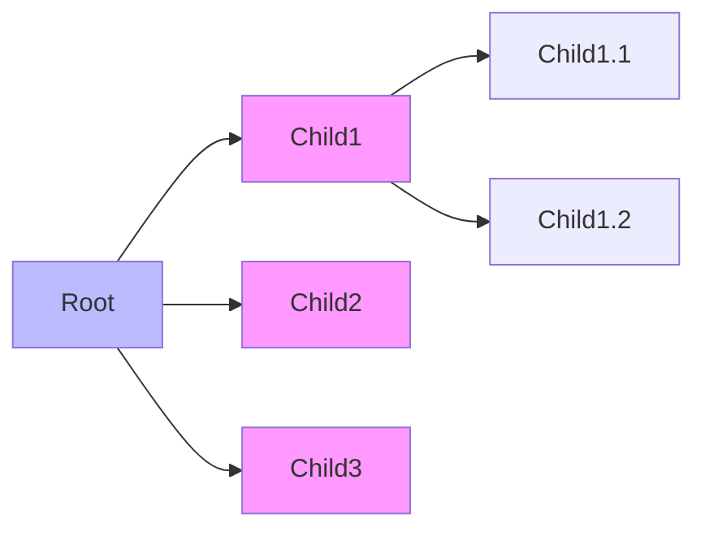
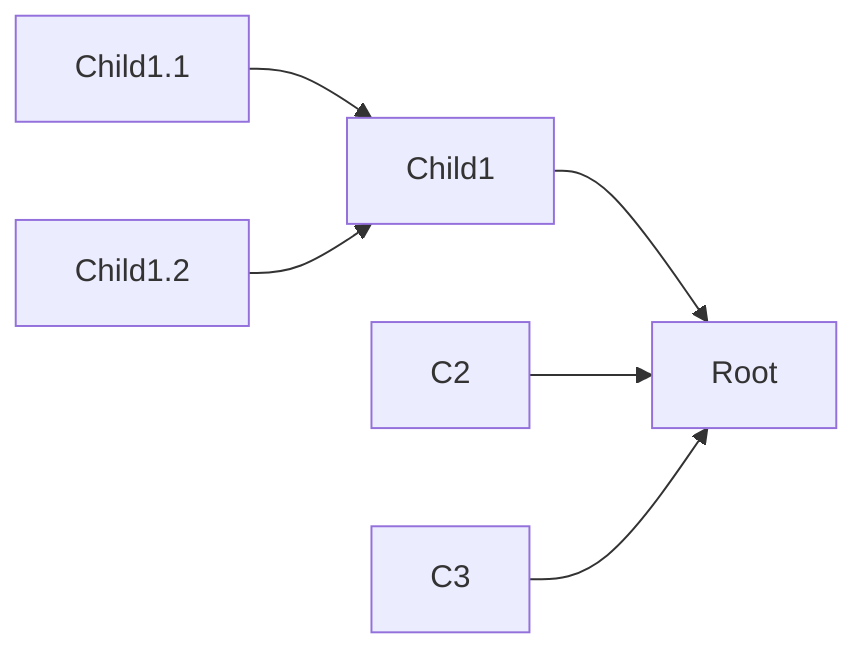

# Alberi Generali — Sintesi
Docente: A. Pietracaprina

Questo file riassume i concetti principali sugli alberi generali presentati nelle slide. Tutte le sezioni dedicate agli esercizi sono state omesse come richiesto.

---

## Nozione informale
Un albero è una collezione di nodi collegati da relazioni padre-figlio che formano una struttura gerarchica che si dipana da una radice. Una lista è un caso particolare di albero con struttura lineare.

Campi applicativi principali:
- Strutture dati (mappe, priority queue)
- Esplorazione risorse (filesystem, siti e-commerce)
- Sistemi distribuiti e reti (synchronization, broadcast, gathering)
- Analisi di algoritmi (albero della ricorsione)
- Classificazione (alberi di decisione)
- Compressione dati (codici di Huffman)
- Biologia computazionale (alberi filogenetici)

---

## Definizione formale di albero radicato
Un albero radicato T (non vuoto) soddisfa:
- Esiste un nodo speciale r ∈ T (radice).
- Per ogni v ∈ T, v ≠ r, esiste un unico u ∈ T che è padre di v.
- Per ogni v ∈ T, v ≠ r, risalendo di padre in padre si arriva alla radice r (ogni nodo è discendente della radice).

Nota: senza la terza condizione si possono ottenere strutture non sensate (cicli/foreste).

Definizione ricorsiva:
T = {r} ∪ T1 ∪ T2 ∪ ... ∪ Tk, dove ui sono i figli di r e ciascun Ti è l'albero radicato in ui.

Albero ordinato: per ogni nodo interno è definito un ordine lineare tra i figli.

---

## Terminologia
- Antenati: x è antenato di y se x = y oppure x è antenato del padre di y.
- Discendenti: x è discendente di y se y è antenato di x.
- Nodi interni: nodi con ≥ 1 figli.
- Nodi esterni (foglie): nodi senza figli.
- Sottoalbero con radice v: Tv include v e tutti i suoi discendenti.

---

## Profondità e altezza
Depth (profondità) di v: depth_T(v)
- Def.1: depth_T(v) = |antenati(v)| − 1
- Def.2 (ricorsiva): depth(root) = 0; altrimenti depth(v) = 1 + depth(parent(v))

Livello i: insieme dei nodi di profondità i.

Height (altezza) di v: height_T(v)
- Se v è foglia ⇒ height_T(v) = 0
- Altrimenti height_T(v) = 1 + max_{w figlio di v} height_T(w)

Altezza dell'albero: height(T) = height_T(root).

Proposizione (GTG14 Prop. 8.3):
height(T) = max_{v foglia} depth_T(v) (l'altezza è la massima profondità tra le foglie).

---

## Interfacce Iterator e Iterable (sintesi)
Iterator e Iterable sono astrazioni per enumerare gli elementi di una collezione.

Esempio:
```java
public interface Iterator<E> {
  boolean hasNext();
  E next();
}

public interface Iterable<E> {
  Iterator<E> iterator();
}
```

---

## Interfaccia Tree (sintesi)
API tipica per alberi generali (assumendo complessità Θ(1) per la maggior parte dei metodi, salvo children/iterator/positions):
```java
public interface Tree<E> extends Iterable<E> {
  int size();
  boolean isEmpty();
  Position<E> root();
  Position<E> parent(Position<E> p);
  Iterable<Position<E>> children(Position<E> p);
  int numChildren(Position<E> p);
  boolean isInternal(Position<E> p);
  boolean isExternal(Position<E> p);
  boolean isRoot(Position<E> p);
  Iterator<E> iterator();
  Iterable<Position<E>> positions();
}
```

---

## Algoritmi ricorsivi base

Calcolo della profondità (depth):
```text
depth(v)
  if T.isRoot(v) then return 0
  else return 1 + depth(T.parent(v))
```

Calcolo dell'altezza (height) di un nodo v:
```text
height(v)
  h ← 0
  foreach w ∈ T.children(v) do
    h ← max(h, 1 + height(w))
  return h
```
L'algoritmo height è tipicamente una visita postorder.

---

## Visite di alberi generali (pattern)
Visite sono pattern algoritmici applicati a tutti i nodi; due principali per alberi generali:

- Preorder: visita il nodo prima dei figli. Utile quando l'operazione su un nodo dipende dagli antenati (es. stampa struttura gerarchica, indice di un libro, esplorazione filesystem).
  Pattern:
  ```text
  preorder(v)
    visita v
    foreach w ∈ T.children(v) do
      preorder(w)
  ```
  Chiamata iniziale: preorder(T.root())

- Postorder: visita i figli prima del padre. Utile quando l'operazione su un nodo dipende dai discendenti (es. calcolo dimensione aggregata di cartelle).
  Pattern:
  ```text
  postorder(v)
    foreach w ∈ T.children(v) do
      postorder(w)
    visita v
  ```
  Chiamata iniziale: postorder(T.root())

Complessità: entrambe visitano ogni nodo una volta ⇒ O(n).

Esempi di algoritmi basati su visite:
- allDepths: calcolare e memorizzare v.depth per ogni nodo (adattamento di preorder).
- height (per ogni nodo): effettuabile come postorder memorizzando v.height.
- diskSpace: nel modello filesystem, calcolare v.aggr-size (somma ricorsiva dei loc-size dei discendenti) con postorder.

---

## Osservazioni sulla scrittura ricorsiva
- Le variabili possono essere locali o "globali" persistenti.
- I valori restituiti dalle chiamate ricorsive devono essere usati; altrimenti risultano inutili.
- Alcune soluzioni naive (es. chiamare depth su ogni foglia per trovare l'altezza) possono essere molto inefficienti; preferire visite che consentono calcoli in una singola scansione.

---

## Diagrammi (Mermaid compatibili GitHub)

Diagramma: struttura di un albero generale


Diagramma: esempio di visita preorder (ordine visuale)


Diagramma: esempio di visita postorder (ordine visuale)


---

## Riepilogo
- Definizioni fondamentali: radice, antenati, discendenti, foglie, sottoalbero, profondità, altezza.
- Due formulazioni equivalenti di albero radicato: non ricorsiva e ricorsiva.
- Interfaccia Tree e uso di Iterator/Iterable per enumerazione.
- Pattern di visita: preorder (antenati prima), postorder (discendenti prima); entrambi utili per varie applicazioni e calcoli in una singola passata O(n).
- Proposizione chiave: l'altezza di un albero è la massima profondità tra le foglie.

---

Fine della sintesi.
