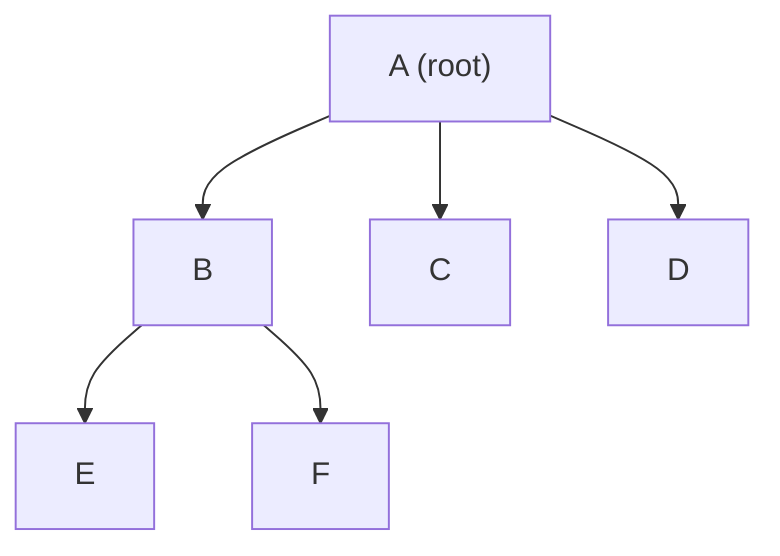
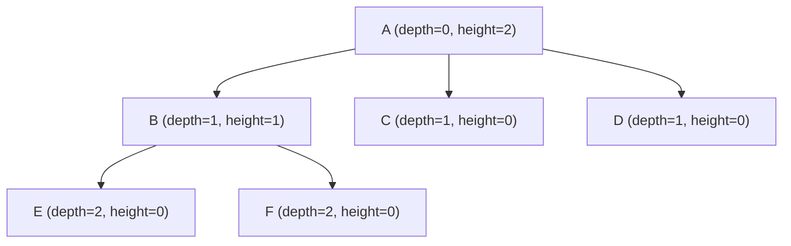
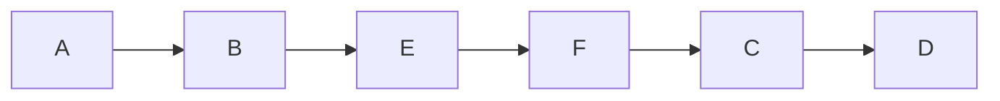
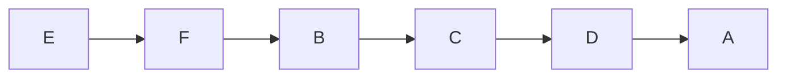
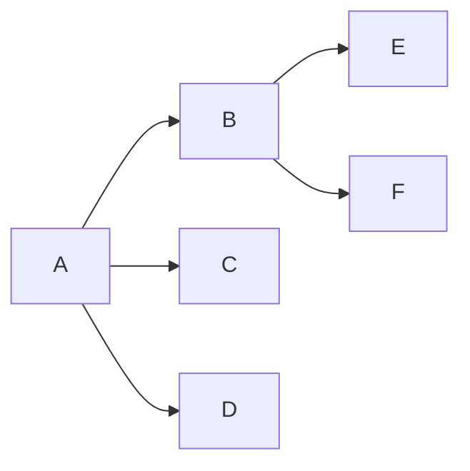

# Alberi generali

Cos'è un albero (algoritmico)
- Struttura dati gerarchica, connessa e aciclica.
- Un nodo radice (root); ogni nodo ha esattamente un genitore (tranne la radice) e 0+ figli.
- Usati per gerarchie, AST, trie, indici, ecc.

Terminologia breve
- Nodo, radice, genitore, figlio, fratello, foglia (leaf), nodo interno.

Profondità e altezza
- Profondità (depth) di un nodo: numero di archi dal root a quel nodo (root depth = 0).
- Altezza (height) di un nodo: numero massimo di archi da quel nodo fino a una foglia.
- Altezza dell'albero: altezza della radice.
- Nota: alcune definizioni contano nodi invece di archi — essere coerenti.

Ho aggiornato i diagrammi Mermaid per assicurare compatibilità con il renderer di GitHub: uso "graph" (TD/LR), metto le etichette tra virgolette quando contengono spazi o parentesi e metto ogni dichiarazione su una riga separata. Questi accorgimenti risolvono gli errori di parsing segnalati.

Esempio: struttura dell'albero


Illustrazione di profondità e altezza (annotata)


Traversamenti: sequenze semplificate

Pre-order (root, poi figli) — sequenza:

Sequenza pre-order: A → B → E → F → C → D

Post-order (figli, poi root) — sequenza:

Sequenza post-order: E → F → B → C → D → A

Level-order (BFS) — sequenza per livelli:

Sequenza level-order: A → B → C → D → E → F

Traversamenti (visit)
- Pre-order (radice, poi figli): utile per serializzare o copiare. Ricorsione o stack.
- Post-order (figli, poi radice): utile per deallocare o valutare espressioni.
- In-order: definito per alberi binari (sinistra, radice, destra); utile per BST.
- Level-order (BFS): visita per livelli, usa una coda.

Complessità
- Tempo: visita completa → O(n) (n = numero di nodi).
- Spazio: DFS ricorsiva O(h) (h = altezza), BFS O(b) (b = larghezza massima, fino a O(n)).

Esempio minimale (albero n-ario) — Python
```python
class Node:
    def __init__(self, value):
        self.value = value
        self.children = []

# Esempio:
#       A
#     / | \
#    B  C  D
#   / \
#  E   F
A = Node('A'); B = Node('B'); C = Node('C')
D = Node('D'); E = Node('E'); F = Node('F')
A.children = [B, C, D]; B.children = [E, F]

# Pre-order
def preorder(node):
    if not node: return
    print(node.value)
    for c in node.children: preorder(c)

# Level-order (BFS)
from collections import deque
def level_order(root):
    if not root: return
    q = deque([root])
    while q:
        node = q.popleft()
        print(node.value)
        for c in node.children: q.append(c)

# Depth (ricerca del valore)
def depth(node, target, cur=0):
    if not node: return -1
    if node.value == target: return cur
    for c in node.children:
        d = depth(c, target, cur+1)
        if d != -1: return d
    return -1

# Altezza
def height(node):
    if not node or not node.children: return 0
    return 1 + max(height(c) for c in node.children)
```

Esempi rapidi
- preorder(A) → A B E F C D
- level_order(A) → A B C D E F
- height(A) → altezza dell'albero (numero massimo di archi dalla radice a una foglia)

File breve e pratico: definizione, metriche, traversamenti principali, complessità, esempi e diagrammi Mermaid compatibili con GitHub.
