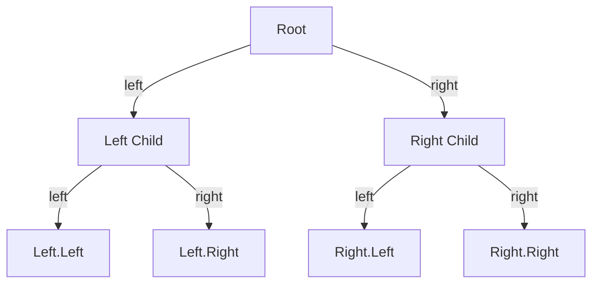
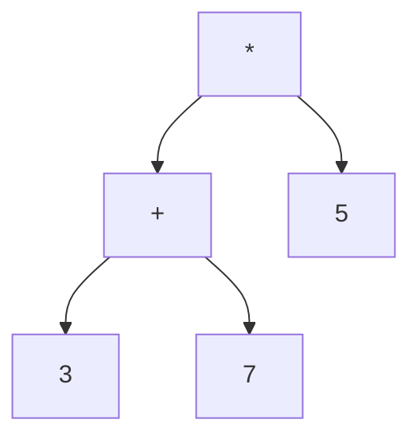
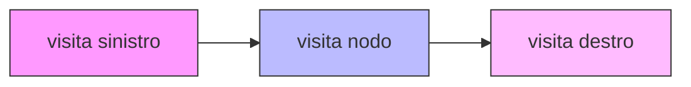

# Alberi Binari — Sintesi
Docente: A. Pietracaprina

Questo file riassume i concetti principali sugli alberi binari trattati nelle slide fornite. Gli esercizi sono stati omessi come richiesto.

---

## Definizioni essenziali

- Albero ordinato: i figli di ogni nodo hanno un ordine.
- Grado di un albero: massimo numero di figli di un nodo interno.
- Albero binario T: albero ordinato in cui
  - ogni nodo interno ha ≤ 2 figli;
  - ogni nodo non radice è etichettato come figlio sinistro (sx) o destro (dx) del suo padre;
  - se un nodo ha entrambi i figli, il figlio sx viene prima del figlio dx nell'ordinamento.
- Albero binario proprio (full / pieno): ogni nodo interno ha esattamente 2 figli.

---

## Terminologia e quantità
Siano:
- n = numero totale di nodi in T
- m = numero di foglie (leaf)
- n_I = numero di nodi interni (n_I = n − m)
- h = altezza di T (massima profondità di una foglia, con convenzione della slide)

Proprietà importanti per alberi binari propri (non vuoti):
1. m = n − m + 1 (equivalente a m = n_I + 1)
2. h + 1 ≤ m ≤ 2^h
3. h ≤ n − m ≤ 2^h − 1
4. 2^h + 1 ≤ n ≤ 2^{h+1} − 1
5. log2(n + 1) − 1 ≤ h ≤ (n − 1) / 2

Nota importante: in assenza di altre ipotesi, il miglior upper bound sull'altezza di un albero binario con n nodi è O(n) e non O(log n).

---

## Interfaccia (esempio Java)
```java
public interface BinaryTree<E> extends Tree<E> {
  /** Returns the Position of p’s left child (or null if it doesn’t exists) */
  Position<E> left(Position<E> p);
  /** Returns the Position of p’s right child (or null if it doesn’t exists) */
  Position<E> right(Position<E> p);
  /** Returns the Position of p’s sibling (or null if no sibling exists) */
  Position<E> sibling(Position<E> p);
}
```

---

## Traversal (visite)
Tre visite fondamentali per alberi binari:

- Preorder: visita il nodo, poi ricorsivamente il sottoalbero sinistro, poi il destro.
- Inorder: prima (ricorsivamente) il sottoalbero sinistro, poi il nodo, poi il sottoalbero destro.
- Postorder: prima (ricorsivamente) il sottoalbero sinistro, poi il destro, poi il nodo.

Tutte e tre le visite visitano ogni nodo esattamente una volta: complessità O(n).

### Pseudocodice (inorder)
```text
inorder(v)
  if T.left(v) != null then inorder(T.left(v))
  visita v
  if T.right(v) != null then inorder(T.right(v))
```
Chiamata iniziale: inorder(T.root()).

---

## Applicazioni delle visite: Parse Tree ed espressioni aritmetiche

Definizione (Parse Tree):
- Per espressioni con soli operatori binari, il Parse Tree è un albero binario proprio.
  - Foglie: costanti o variabili.
  - Nodi interni: operatori binari; il sottoalbero sinistro rappresenta il primo operando, il destro il secondo.

Dalla stessa struttura si ottengono diverse notazioni tramite visite:
- Notazione infissa (infix): ottenere Ev tramite visita inorder, inserendo parentesi per preservare l'associazione.
- Notazione postfissa (postfix, RPN): ottenere Ev tramite visita postorder.

### Generazione in notazione infissa (schema)
```text
infix(T, v, L)
  if T.isExternal(v) then L.addLast(v.getElement())
  else
    L.addLast('(')
    infix(T, T.left(v), L)
    L.addLast(v.getElement())     // l'operatore
    infix(T, T.right(v), L)
    L.addLast(')')
```
Chiamata iniziale: infix(T, T.root(), L) con L = [].

### Generazione in notazione postfissa (schema)
```text
postfix(T, v, L)
  if T.isExternal(v) then L.addLast(v.getElement())
  else
    postfix(T, T.left(v), L)
    postfix(T, T.right(v), L)
    L.addLast(v.getElement())
```
Chiamata iniziale: postfix(T, T.root(), L) con L = [].

Entrambi gli algoritmi hanno complessità O(n).

---

## Esempi grafici (diagrammi mermaid)

Diagramma: struttura di un tipico albero binario (radice con figli sx/dx)


Diagramma: esempio di Parse Tree per l'espressione (3 + 7) * 5


Diagramma: ordine di visita inorder (schematico)


---

## Riepilogo dei concetti chiave
- Differenza tra albero binario e albero binario proprio.
- Relazioni numeriche tra foglie, nodi interni, altezza e numero totale di nodi in alberi binari propri.
- Traversal: preorder, inorder, postorder (modelli ricorsivi e complessità O(n)).
- Parse Tree: rappresentazione ad albero delle espressioni; conversione tra notazioni usando visite.
- Importante: senza ipotesi addizionali un albero binario può avere altezza Θ(n).

---

Fine del riepilogo.
