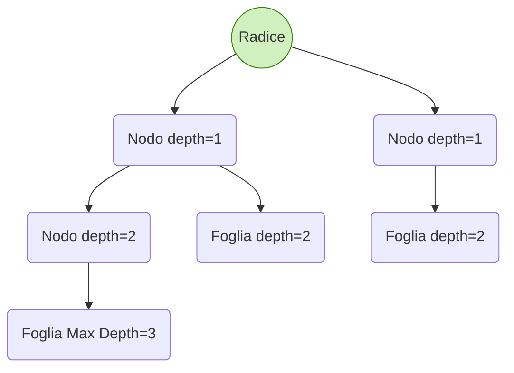

# 1.Nozioni di base
## Notazione formale
Un probelma computazionale é formato da un insieme di coppie (istanza, soluzione) dove istanze e soluzioni provengono dai rispettivi domini.

Un problema computazionale é costituito da:
  - Istanze $I\in D(I)$
  - Soluzioni $S\in D(S)$
  - Relazione $\Pi\in D(\Pi)\sube D(I)\times D(S)$  

Dove $D(I)$ e $D(S)$ sono i dominii di $I$ ed $S$, notare che $D(\Pi)$ é un sottoinsieme in quanto non é detto che i dominii di istanze e soluzioni siano esauriti da $\Pi$ (per esempio nella divisione tra interi $D(I) = N\times N$ ma alle infinite istanze con zero al denominatore non é associato nessun elemento di $\Pi$)

## Complessitá nel tempo
### Recap ordini di grandezza

- **Big O:**  
  $f(n) \in O(g(n))$ se $\exists n_0 \mid f(n) \leq g(n) \quad \forall n > n_0$

- **Omega:**  
  $f(n) \in \Omega(g(n))$ se $\exists n_0 \mid f(n) \geq g(n) \quad \forall n > n_0$

- **Theta:**  
  $f(n) \in \Theta(g(n))$ se $f(n) \in \Omega(g(n))$ e $f(n) \in O(g(n))$, quindi se $f(n)$ è proporzionale a $g(n)$.

- **Small o:**  
  $f(n) \in o(g(n))$ se $\lim_{n \to \infty}\frac{f(n)}{g(n)} =0$, quindi $f(n)$ é asintoticamente più piccolo di $g(n)$ 

### Approssimazione logaritmo
$\lfloor\log_a b\rfloor := n$ approssimabile a $b/(a^n) \leq 1$, ovvero al numero di volte che devo dividere $B$ per $a$ per ottenere 1 come risultato.
$$log_a b = c \Rightarrow b = a^c \Rightarrow b/a^c=1 $$

### nota di calcolo: 
Per determinare la complessitá proporzionale si trova prima $O(\cdot)$ che vale per tutti i casi e poi $\Omega(\cdot)$ al caso pessimo, se sono uguali allora la complessitá é proporzionale a $\Theta(\cdot)$.  

## Proprietà degli Ordini di Grandezza

Queste proprietà descrivono il comportamento asintotico delle funzioni (complessità).

$$\max\{f(n), g(n)\} \in \Theta (f(n) + g(n))$$


$$\sum_{i=0}^{k} a_i n^i \in \Theta(n^k) \quad \text{se } a_k > 0$$

$$\log_b n \in \Theta (\log_a n) \quad \text{se } a, b > 1$$
**Conseguenza:** La base costante del logaritmo si omette ($\Theta(\log n)$).


$$n^k \in o (a^n) \quad \text{se } k > 0, a > 1$$
**Significato:** La funzione esponenziale domina (cresce strettamente più velocemente).


$$(\log_b n)^k \in o(n^h) \quad \text{se } b > 1, h, k > 0$$
**Significato:** La funzione polinomiale domina (cresce strettamente più velocemente).

## Formule Chiave per Somme (Complessità Asintotica)

* **Somma Aritmetica (Lineare):**
    $$\sum_{i=1}^{n} i = \frac{n(n+1)}{2} \in \Theta(n^2)$$

* **Somma di Quadrati:**
    $$\sum_{i=1}^{n} i^2 = \frac{n(n+1)(2n+1)}{6} \in \Theta(n^3)$$

* **Somma Serie Geometrica (a > 1):**
    $$\sum_{i=0}^{n} a^i = \frac{a^{n+1} - 1}{a - 1} \in \Theta(a^n)$$

* **Caso Specifico (a=2):**
    $$\sum_{i=0}^{n} 2^i = 2^{n+1} - 1 \in \Theta(2^n)$$

* **Somma Serie Geometrica (Convergenza, $0 < a < 1$):**
    $$\sum_{i=0}^{\infty} a^i = \frac{1}{1 - a} \in \Theta(1)$$

* **Somma Armonica:**
    $$\sum_{i=1}^{n} \frac{1}{i} = H_n \approx \ln n \in \Theta(\log n)$$

## Terminologia della Complessità Asintotica

* **Logaritmica:** $\Theta(\log n)$  Base 2 o costante $> 1$.
* **Polilogaritmica:** $\Theta((\log n)^c)$ $c > 0$ costante.
* **Lineare:** $\Theta(n)$
* **Quadratica:** $\Theta(n^2)$
* **Cubica:** $\Theta(n^3)$
* **Polinomiale:** $\Theta(n^c)$ $c > 0$ costante.
* **Esponenziale:** $\Omega(a^n)$ $a > 1$ costante.

## Correttezza di un algoritmo
**Terminazione** Va dimostrato che l'algoritmo termina (non procede all'infinito)
**Segmenti** Dimostrare che a partire dallo stato iniziale si raggiungono in
successione gli stati specificati per la fine di ogni segmento. In
particolare, lo stato che deve valere alla fine dell’ultimo segmento
deve coincidere (o implicare) lo stato finale desiderato.  
**Segmenti notevoli:** cicli (for, while, repeat-until)

Un **invariante** per un ciclo é una proprietá espressa in funzione delle
variabili usate nel ciclo, che descrive lo stato in cui si trova l'esecuzione
alla fine di una generica iterazione del ciclo.

### Correttezza di un ciclo tramite invariante
Per dimostrare che alla fine del ciclo vale una certa proprietá L, si
individua un opportuno invariante e si dimostra che:
 - Esso vale all’inizio del ciclo (subito prima che il ciclo inizi).
 - Esso vale alla fine di ciascuna iterazione. Si dimostra in modo
induttivo provando che se vale alla fine di una generica iterazione,
vale alla fine della successiva.
 -  Alla fine dell’ultima iterazione, l'invariante implica la proprietá L (in
alcuni casi coincide con essa).


### Formula di Binet per Fibonacci

La successione di Fibonacci $F(n)$ è definita dalla ricorrenza $F(n) = F(n-1) + F(n-2)$, con $F(0)=0$ e $F(1)=1$.

### 1. Equazione Caratteristica
Per risolvere la ricorrenza si assume una soluzione della forma $\lambda^n$, che porta all'equazione caratteristica:
$$\lambda^2 - \lambda - 1 = 0$$

### 2. Radici
Le due radici sono il **Rapporto Aureo** ($\Phi$) e la sua coniugata ($\hat{\Phi}$):
* **$\Phi$** (Golden Ratio): $$\Phi = \frac{1 + \sqrt{5}}{2} \approx 1.618$$
* **$\hat{\Phi}$**: $$\hat{\Phi} = \frac{1 - \sqrt{5}}{2} \approx -0.618$$

### 3. Formula Chiusa (Formula di Binet)
La formula chiusa per $F(n)$ (dimostrata usando i casi base $F(0)$ e $F(1)$) è:
$$F(n) = \frac{1}{\sqrt{5}} \left( \Phi^n - \hat{\Phi}^n \right)$$

### 4. Ordine di Grandezza
Poiché $|\hat{\Phi}| < 1$, il termine $\hat{\Phi}^n$ tende a zero rapidamente. La crescita è dominata dal termine $\Phi^n$.
$$\text{Risultato: } F(n) \in \Theta (\Phi^n)$$
La successione di Fibonacci ha quindi una **complessità esponenziale**.

### Algoritmi descritti nelle slide
``` java
Algoritmo arrayMax(A)
Input: array A[0 ÷ n − 1] di n ≥ 1 interi
Output: max intero in A
currMax ← A[0];
for i ← 1 to n − 1 do
    if (currMax < A[i]) then currMax ← A[i];
return currMax
```
complessitá arrayMax $\Theta(n)$
``` java
Algoritmo prefixAverages1
for i ← 0 to n − 1 do
    a ← 0;
    for j ← 0 to i do
        a ← a + X[j];
    A[i] ← a/(i+1);
return A
``` 
complessitá prefixAverages1 $\Theta(n^2)$

``` java
Algoritmo prefixAverages2
s ← 0;
for i ← 0 to n − 1 do
    s ← s + X[i];
    A[i] ← s/(i+1);
return A
``` 
complessitá prefixAverages2 $\Theta(n)$

``` java
Algoritmo InsertionSort(S)
input Sequenza S[0 . . . n-1] di n chiavi
output Sequenza S ordinata in senso crescente
for i ← 1 to n-1 do {
    curr ← S[i]
    j ← i-1
    while ((j ≥ 0) AND (S[j]> curr)) do {
        S[j+1] ← S[j]
        j ← j-1
    }
    S[j+1] ← curr
}
``` 
Pittoricamente sposto i numeri fino a che non raggiungo un numero minore di quello corrente (curr).   
complessitá InsertionSort $\Theta(n^2)$

```java
Algoritmo MergeSort(S)
Input: sequenza S = S[0]S[1] . . . S[n − 1] di n ≥ 0 chiavi
Output: sequenza S ordinata in senso non decrescente
if n ≤ 1 then return;
S1, S2 ← sequenze vuote;
for i ← 0 to ceil(n/2) − 1 do S1[i] ← S[i];
for i ← ceil(n/2) to n − 1 do S2[i − ceil(n/2)] ← S[i];
MergeSort(S1);
MergeSort(S2);
Merge(S1,S2,S);
```
Osservazione: Merge(S1,S2,S) fonde S1 e S2 in un’unica sequenza
ordinata S che usa lo stesso spazio dalla sequenza di input.
complessitá MergeSort $\Theta(n log n)$


``` java
Algoritmo linearSum(A,n)
Input: array A, intero n ≥ 1
Output: Pn−1
i=0 A[i]
if (n = 1) then return A[0];
else return linearSum(A,n − 1)+A[n − 1];
``` 
complessitá linearSum $\Theta(n)$
``` java
Algoritmo reverseArray(A,i,j)
Input: array A, indici i, j ≥ 0
Output: array A con gli elementi in A[i ÷ j] ribaltati
if (i < j) then
    swap(A[i],A[j]);
    reverseArray(A,i + 1,j − 1)
return
``` 
complessitá reverseArray $\Theta(n)$
``` java
Algoritmo power(x,n)
Input: x ∈ R e n ≥ 0 intero
Output: p(x, n)
if (n = 0) then return 1;
if (n dispari) then
    y ←power(x,(n − 1)/2);
    return x · y · y;
else
    y ←power(x,n/2);
    return y · y
``` 
complessitá power $\Theta(log(n))$ in quanto continuo a dividere per due (vedi precedente definizione di logaritmo)
``` java
Algoritmo powerFib(n)
Input: intero n ≥ 0
Output: F(n)
Φ ←(1 + √5)/2;
Φˆ←(1 − √5)/2;
return (power(Φ, n) − power(Φˆ, n))/√5
``` 
complessitá powerFib $\Theta(log(n))$, utilizzando un implementazione ricorsiva naive ho $O(2^n) mentre con un implementazione iterativa con memorizzazione avrei $O(n)$.
# 2.Alberi
## Alberi generali
 ## 🌳 Terminologia degli Alberi Radicati (Rooted Trees)

### 1. Definizione di Albero Radicato
Un albero radicato $T$ non vuoto soddisfa le seguenti proprietà:
* Esiste un nodo speciale **radice** ($r \in T$).
* Ogni nodo $v \ne r$ ha un **padre** $u$ **unico**.
* Ogni nodo $v \ne r$ è **discendente** della radice (risalendo i padri si arriva sempre a $r$).

### 2. Definizione Ricorsiva
Un albero radicato $T$ è partizionato come:
$$T = \{r\} \cup T_1 \cup T_2 \cup \dots \cup T_k$$
dove $r$ è la radice con figli $u_1, \dots, u_k$, e ogni $T_i$ è un albero non vuoto radicato nel figlio $u_i$.

---

### 3. Altre Definizioni Chiave

| Termine | Definizione |
| :--- | :--- |
| **Antenato** di $y$ | $x=y$ o $x$ è antenato del padre di $y$. |
| **Discendente** di $y$ | $y$ è antenato di $x$. |
| **Nodo Interno** | Nodo con $\ge 1$ figli. |
| **Nodo Esterno (Foglia)** | Nodo senza figli. |
| **Sottoalbero** $T_v$ | Albero formato da tutti i discendenti di $v$ (incluso $v$). |
| **Albero Ordinato** | Per ogni nodo interno, è definito un ordinamento lineare tra i suoi figli. |

---

### 4. Misure di Profondità e Altezza

| Misura | Definizione 1 (Non Ricorsiva) | Definizione 2 (Ricorsiva) |
| :--- | :--- | :--- |
| **Profondità** $\text{depth}_T(v)$ | Numero di archi da $r$ a $v$. $|Antenati(v)| - 1$. | $0$ se $v=r$, altrimenti $1 + \text{depth}_T(\text{padre}(v))$. |
| **Altezza** $\text{height}_T(v)$ | Lunghezza del cammino più lungo da $v$ a una foglia. | $0$ se $v$ è foglia, altrimenti $1 + \max_{w \text{ figlio di } v} (\text{height}_T(w))$. |
| **Altezza di $T$** $\text{height}(T)$ | $\text{height}_T(r)$, altezza della radice. |

**Livello $i$:** L'insieme dei nodi a profondità $i$.

**Proposizione:** L'altezza di un albero $T$ è uguale alla massima profondità tra tutte le foglie:
$$\text{height}(T) = \max_{v \in T: v \text{ foglia}} (\text{depth}_T(v))$$



```java
public interface Tree<E> extends Iterable<E> {
/** Returns the number of positions in the tree */
int size();
/** Returns true if the tree contains no positions */
boolean isEmpty();
/** Returns the Position of the root (or null if empty)*/
Position<E> root();
/** Returns the Position of p’s parent (or null if p is the root) */
Position<E> parent(Position<E> p);
/** Returns an iterable containing p’s children */
Iterable<Position<E>> children(Position<E> p);
/** Returns the number of children of p */
int numChildren(Position<E> p);
/** Returns true if p is internal */
boolean isInternal(Position<E> p);
/** Returns true if p is external */
boolean isExternal(Position<E> p);
/** Returns true if p is root */
boolean isRoot(Position<E> p);
/** Returns an iterator to all element in the tree */
Iterator<E> iterator();
/** Returns an iterable containing all positions in the tree */
Iterable<Position<E>> positions();
}
```

```java
Algoritmo: depth(v)
Input: v ∈ T
Output: profonditá di v in T
if (T.isRoot(v)) then return 0 // (CASO BASE);
else return 1+depth(T.parent(v));
```
complessitá caso pessimo $\Theta(depth(v))$ in caso di albero "verticale" $\Theta(n)$.

```java
Algoritmo: height(v)
Input: v ∈ T
Output: altezza di v in T
h ← 0;
foreach w ∈ T.children(v) do h ← max{h, 1+height(w)} ;
return h
```
anche qui complessitá $O(n)$ in alternativa per calcolare l'altezza di root si puó usare la preposizione di cui sopra con la massima profonditá.

## Visite
```java
Algoritmo preorder(v)
Input: nodo v ∈ T
Output: risultante dalla visita di Tv
visita v;
foreach w ∈ T.children(v) do
    preorder(w)
```
```java
Algoritmo postorder(v)
Input: nodo v ∈ T
Output: risultante dalla visita di Tv
foreach w ∈ T.children(v) do
    postorder(w)
visita v;
```
entrambe $O(n)$

```java
Algoritmo allDepths(T,v)
Input: v in T e u.depth impostato correttamente per u padre di v.
Output: z.depth impostato correttamente perogni z nel sottoalbero T_v
if T.isRoot(v) then v.depth <- 0;
else v.depth <- 1+ T.parent(v).depth + 1;
forall w in T.childern(v) do allDepths(T,w)
```
nota: esempio visita in preorder (prima da padri a figli)

## Alberi Binari
```java
Interfaccia BinaryTree
public interface BinaryTree<E> extends Tree<E> {
/** Returns the Position of p’s left child (or null if it doesn’t exists) */
Position<E> left(Position<E> p);
/** Returns the Position of p’s right child (or null if it doesn’t exists) */
Position<E> right(Position<E> p);
/** Returns the Position of p’s sibling (or null if no sibling exists) */
Position<E> sibling(Position<E> p);
}
```

## 🌳 Alberi Binari: Definizioni e Proprietà

### 1. Definizione di Albero Binario (Binary Tree)

Un **Albero Binario** $T$ è un albero ordinato dove:
* Ogni nodo interno ha **al massimo 2 figli** ($\le 2$).
* Ogni nodo non radice è etichettato come **figlio sinistro (sx)** o **destro (dx)** del suo padre.
* Il figlio sx precede il dx nell'ordinamento.

Un **Albero Binario Proprio** ($T$) è un albero binario in cui ogni nodo interno ha **esattamente 2 figli**.

---

### 2. Proprietà degli Alberi Binari Propri Non Vuoti

Sia $n$ il numero totale di nodi, $m$ il numero di foglie ($n_E$), $n-m$ il numero di nodi interni ($n_I$), e $h$ l'altezza.

| Proprietà | Relazione |
| :--- | :--- |
| Foglie vs. Interni | $$m = n - m + 1$$ |
| Foglie vs. Altezza | $$h + 1 \le m \le 2^h$$ |
| Nodi Totali vs. Altezza | $$2h + 1 \le n \le 2^{h+1} - 1$$ |
| Altezza vs. Nodi Totali | $$\log_2(n+1) - 1 \le h \le \frac{n-1}{2}$$ |

---

### 3. Visita Inorder (Alberi Binari)

La visita **Inorder** segue la regola: **Sx** $\to$ **Padre** $\to$ **Dx**.

#### Algoritmo: `inorder(v)` (Pseudocodice)

```pseudocode
Algoritmo: inorder(v)
Input: v ∈ T (Posizione/Nodo)

1. se T.left(v) è NOT NULL allora
2.     inorder(T.left(v));
3. fine se

4. visita v; // Processa il nodo padre

5. se T.right(v) è NOT NULL allora
6.     inorder(T.right(v));
7. fine se

// Chiamata iniziale: inorder(T.root())

```

## notazione infissa e postfissa
vedi slide.

# 3.Priority queue

Una Entry `e una coppia (chiave, valore), dove la chiave proviene
da un dominio K e il valore da un dominio V.

Priority Queue: collezione di entry le cui chiavi rappresentano
prioritá e provengono da un universo totalmente ordinato K.  
Come tipo di dato astratto, la Priority Queue deve permettere di
- Trovare/rimuovere la entry di massima priorit`a.
- Inserire una nuova entry.  

Le chiavi delle entry non sono necessariamente distinte

```java
public interface PriorityQueue<K,V> {
int size();
boolean isEmpty();
/** Inserts and returns a new entry (key,value) */
Entry<K,V> insert(K key, V value);
/** Returns an entry with min key, without removing it */
Entry<K,V> min();
/** Returns and removes an entry with min key */
Entry<K,V> removeMin();
}
```
Osservazione: Se esistono pi`u entry con chiave minima, min e
removeMin ne restituiscono (e removeMin ne rimuove) una arbitraria

### Implementazioni:
Tra i modi di implementare le priority queue ci sono le liste, le liste ordinate e gli heap.

## ⏱️ Complessità delle Operazioni di Coda a Priorità (Big O)

Questa tabella mostra la complessità nel caso peggiore $O()$ per le operazioni della coda a priorità, a seconda della struttura dati utilizzata.

| Operazione | Lista Non Ordinata | Lista Ordinata | Heap Binario |
| :--- | :--- | :--- | :--- |
| **insert(k, v)** | **$O(1)$** | **$O(n)$** | **$O(\log n)$** |
| **min()** | **$O(n)$** | **$O(1)$** | **$O(1)$** |
| **removeMin()** | **$O(n)$** | **$O(1)$** | **$O(\log n)$** |

per le implementazioni tramite lista vedi slide..

### Albero Binario Completo T
Albero binario di altezza h ≥ 0 tale che
- ∀i, 0 ≤ i ≤ h −1: il livello i ha 2
i nodi (=max numero di nodi)
- al livello h − 1 tutti i nodi interni sono alla sx delle eventuali
foglie e hanno tutti 2 figli tranne, eventualmente, quello pi`u a
dx che, se ha un solo figlio, ha il figlio sx.

**Proposizione**
Un albero binario completo con n nodi ha altezza $h =\lfloor log_2 n\rfloor$.

### Definizione: min-heap (heap)
Un min-heap (o semplicemente heap) é un albero binario completo in cui ogni
nodo v memorizza una entry e soddisfa la
heap-order property: la chiave in v é minore o uguale della chiave in ciascun
figlio di v
### Definizione: max-heap
Max-heap: uno heap in cui la definizione della heap-order property cambia
come segue
minore o uguale ⇒ maggiore o uguale
### Definizione: nodo last
Il nodo last in uno heap di altezza h é il nodo piú a dx del livello h.

Osservazione: uno heap é caratterizzato da 2 proprietá: (i) albero binario
completo; e (ii) heap-order property (per ogni nodo!)

## Proprieta di uno heap
Sia P uno heap con n entry. Dalla definizione si ricavano
facilmente le seguenti proprietá:
 - 1 Le chiavi incontrate lungo un cammino dalla radice verso le
foglie formano una sequenza non decrescente.
 - 2 Per qualsiasi discendente u di un nodo v ∈ P si ha che eu.getKey() ≥ ev.getKey().
 - 3 La radice contiene una entry con chiave minima.
 - 4 Se le chiavi sono tutte distinte, la entry con chiave massima
(emax) sta in una foglia di P (es. R-9.10 in [GTG14])

## Implementazione di alberi binari su array
### Level Numbering
Il seguente schema (level numbering) consente di mappare un albero binario su un array P = P[0], P[1], . . . :
- Radice → P[0]
- Figli di P[i] → P[2i + 1], P[2i + 2]
- Padre di P[i] → P [b(i − 1)/2c]

**Osservazione**: La rappresentazione é space-efficient per alberi molto bilanciati (ad es., per alberi binari completi) ma non lo é affatto per alberi sbilanciati, come si vede nei seguenti esempi.

E facile dimostrare che usando il level numbering per mappare un'albero binario completo con n ≥ 1 nodi e altezza h su un array P, si ha che:
- Per ogni 0 ≤ i < h: i 2 i nodi del livello i, presi da sx a dx, sono mappati in P[2i − 1], P[2i], . . . , P[2i+1 − 2]
- I nodi del livello h, presi da sx a dx, sono mappati in P[2h − 1],

## Pattern algoritmici

```java
Metodo insert(k,x)
e ← (k,x);
P[++last] ← e;
i ← last;
// Up-heap bubbling
while ((i > 0) AND (P[(i−1)/2].getKey()> P[i].getKey())) do
    swap( P[i], P[(i−1)/2]);
    i ← (i−1)/2;
return e;
```
Oss. In caso di overflow, si devono prima trasferire le entry in un array
pi`u capiente (di solito di taglia doppia di quello corrente)


Sia `indexMinChild(P, i)` un metodo che restituisce l'indice del figlio di P[i] con chiave minima (2i + 1 o 2i + 2), se P[i] é un nodo iterno (cioé 2i + 1 ≤ last), e restituisce null, se P[i] é foglia.
```java
Algoritmo removeMin()
minentry ← P[0];
P[0] ← P[last--];
i ← 0;
j ← indexMinChild(P, i);
// Down-heap bubbling
while ((j 6= null) AND (P[i].getKey()> P[j].getKey())) do
    swap(P[i],P[j]);
    i ← j;
    j ← indexMinChild(P, i);
return minentry
```
Complessitá di 'insert' e 'removeMin' $\Theta(log(n))$ mentre `min` é semplicemente P.last e quindi $\Theta(1)$

### Definizione: Algoritmo IN-PLACE
Un algoritmo si dice IN-PLACE se usa O (1) memoria aggiuntiva oltre a
quella necessaria per l’input.

## Creazione di un heap a partire da una sequenza qualsiasi

### Soluzione 1 (approccio top-down)
Implementazione: up-heap bubbling da P[j] in ciascuna iterazione j
```java
last ← n − 1;
for j ← 1 to n − 1 do
// Up-heap bubbling a partire da P[j]
i ← j;
while ((i > 0)AND(P[(i−1)/2].getKey()> P[i].getKey())) do
    swap(P[i], P[(i−1)/2]);
    i ← (i−1)/2;
```
complessitá $\Theta(nlogn)$

### Soluzione 2 (approccio bottom-up)
Implementazione: down-heap bubbling da P[j] in ciascuna iterazione j
N.B.: P[b(n − 2)/2c] = nodo interno pi`u a dx del penultimo livello.
```java
last ← n − 1;
for j ← (n − 2)/2 downto 0 do
// Down-heap bubbling a partire da P[j]
i ← j;
k ← indexMinChild(P, i);
while ((k != null)AND(P[i].getKey()> P[k].getKey())) do
    swap(P[i],P[k]);
    i ← k;
    k ← indexMinChild(P, i)
```
CORRETTEZZA: discende immediatamente dall’invariante riportato
nella slide precedente. Si lascia come facile esercizio la dimostrazione che
l’invariante vale alla fine di ciascuna iterazione.
complessitá $\Theta(n)$


## 📦 Algoritmo: Sorting tramite Priority Queue (pqSort)

L'algoritmo `pqSort(S)` ordina una sequenza $S$ di $n$ chiavi utilizzando una Coda a Priorità ($P$) in due fasi:

$$\text{S (Input)} \xrightarrow{\text{Fase A}} P \xrightarrow{\text{Fase B}} \text{S (Output Ordinato)}$$

1.  **Fase A (Inserimento):** Inserire tutte le $n$ chiavi da $S$ in $P$, una alla volta, invocando il metodo `insert`.
2.  **Fase B (Rimozione):** Rimuovere tutte le $n$ chiavi da $P$, una alla volta, invocando il metodo `removeMin`. La sequenza $S$ risultante è ordinata.

---

### ⏱️ Complessità di pqSort(S)

La complessità totale $\Theta()$ è data dalla somma dei tempi di esecuzione delle $n$ operazioni in Fase A e delle $n$ operazioni in Fase B.

| Implementazione di $P$ | Fase A (Inserimento) | Fase B (Rimozione) | Complessità Totale | Algoritmo Corrispondente |
| :--- | :--- | :--- | :--- | :--- |
| **Lista Non Ordinata** | $\Theta(n)$ | $\sum_{i=1}^{n} \Theta(i) \in \Theta(n^2)$ | $\Theta(n^2)$ | Selection Sort |
| **Lista Ordinata** | $\sum_{i=1}^{n} \Theta(i) \in \Theta(n^2)$ | $\Theta(n)$ | $\Theta(n^2)$ | Insertion Sort |
| **Heap (Standard)** | $\sum_{i=1}^{n} \Theta(\log i) \in \Theta(n \log n)$ | $\sum_{i=1}^{n} \Theta(\log i) \in \Theta(n \log n)$ | $\Theta(n \log n)$ | Heap Sort |
| **Heap (Bottom-Up)** | $\Theta(n)$ (Costruzione diretta) | $\sum_{i=1}^{n} \Theta(\log i) \in \Theta(n \log n)$ | $\Theta(n \log n)$ | Heap Sort |

### Osservazioni

* **Heap Sort:** La complessità $\Theta(n \log n)$ deriva dalla gestione dell'heap. Anche se la Fase A può essere ottimizzata a $\Theta(n)$ usando la costruzione *bottom-up* (invece di $n$ inserimenti sequenziali), la Fase B (le $n$ estrazioni del minimo) mantiene il costo a $\Theta(n \log n)$, determinando la complessità totale.

Vedi le ultime pagine delle slide sulle prority queue per l'implementazione inplace di pqsort.

# 4.Mappe

```java
public interface Map<K,V>{
int size();
boolean isEmpty();
V get (K key);
V put (K key, V value);
V remove (K key);
Iterable<K> keySet();
Iterable<V> values();
Iterable<Entry<K,V>> entrySet();
}
```

- get(K key): se ∃ (key,x) restituisce x altrimenti restituisce null
- put(K key, V value): se ∃ (key,x) mette value al posto di x e
restituisce x, altrimenti inserisce l’entry (key, value) e restituisce
null
- remove(K key): se ∃ (key,x) rimuove la entry e restituisce x,
altrimenti restituisce null
- keySet(), values(), entrySet(): restituiscono strutture
(Iterable) contenenti, rispettivamente, le chiavi, i valori e le entry
della mappa che possono essere enumerate da iteratori (iterator).

N.B.: la mappa è vista come associative array nel senso che la chiave
della entry è usata come un “indice” di accesso alla mappa.

## Rapresentazioni di mappe
### Tabelle hash